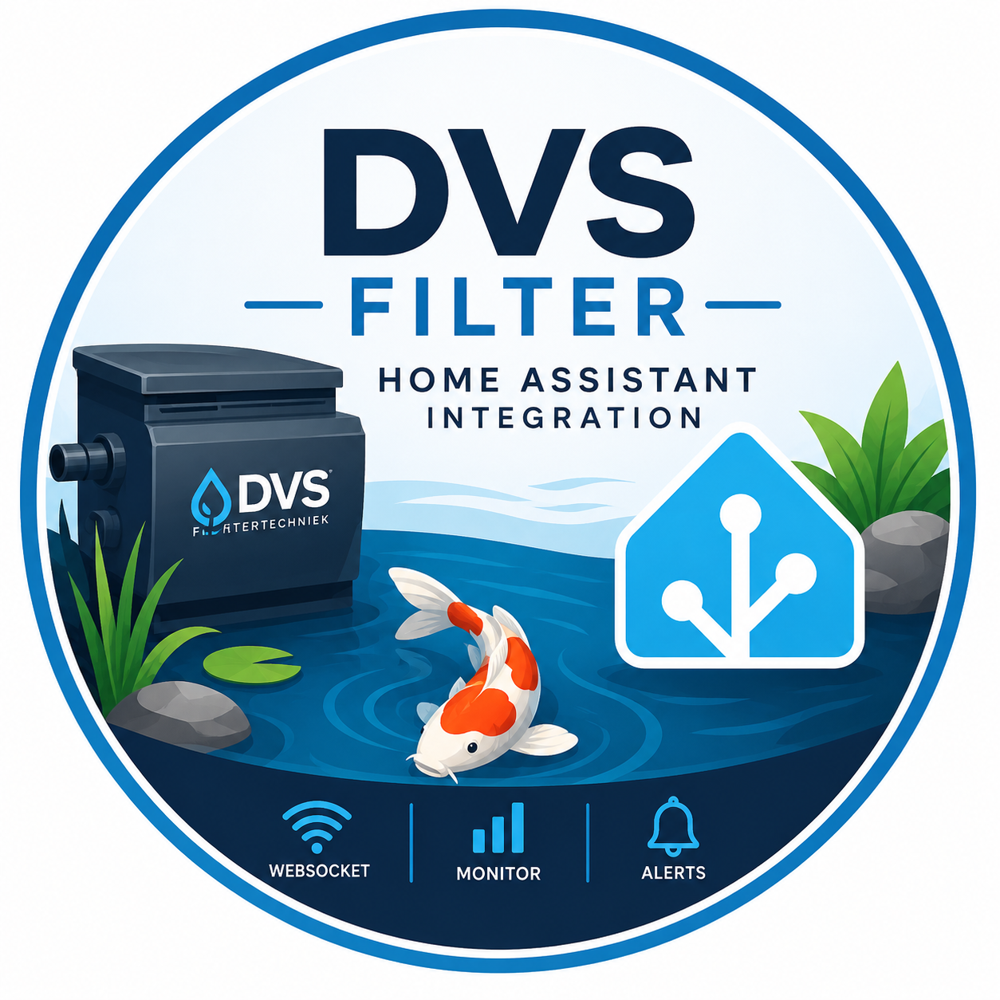

# DVS Filter Home Assistant Integration

Custom Home Assistant integration for DVS Filter controllers.

This project was created to integrate a DVS filter controller into Home Assistant using the built-in WebSocket interface.

## Background

The current DVS controller firmware exposes a WiFi access point with a fixed IP address:

```text
SSID: DVS FILT ...
IP: 192.168.1.1
```

At the moment the controller only operates as an access point and cannot join an existing home network as a WiFi client.

Because of this limitation, the controller is normally only accessible when directly connected to its WiFi network.

## Solution

A GL.iNet Opal (GL-SFT1200) travel router is used as a bridge between the DVS controller and the home network.

### Network topology

```text
Home Network
192.168.x.x
        │
        │
        ▼
GL.iNet Opal
LAN: 192.168.x.10
WAN: 192.168.1.x
        │
        ▼
DVS Controller
192.168.1.1
```

The Opal connects to the DVS WiFi network and exposes the controller on the local network through an nginx reverse proxy.

### Reverse Proxy

The controller becomes available through:

```text
http://192.168.X.10:8080
```

WebSocket traffic is proxied through:

```text
ws://192.168.X.10:8080/ws
```

## Home Assistant Integration

The integration connects to the DVS WebSocket endpoint and exposes the received values as Home Assistant sensors.

Example WebSocket payload:

```json
{
  "4":"0",
  "5":"0",
  "60":"3",
  "61":"0",
  "62":"56",
  "63":"15",
  "64":"0",
  "65":"0",
  "66":"0",
  "67":"0",
  "70":"240.3",
  "120":"1061",
  "121":"107",
  "122":"08:B6:1F:F3:DF:38",
  "123":"CIRCULATION PUMP STOPPED",
  "142":"0",
  "143":"Conditions sending SMS test message: no warnings, not busy and connected to network.",
  "144":"0"
}
```

## Current Status

✅ Reverse proxy operational

✅ WebSocket communication operational

✅ Home Assistant integration operational

✅ Automatic reconnect implemented

⏳ Parameter mapping in progress

## Known Parameters

| Key | Description               |
| --- | ------------------------- |
| 122 | Controller MAC address    |
| 123 | Controller status message |
| 143 | SMS status message        |

Additional parameters are currently being identified.

## Future Improvements

* Proper Home Assistant config flow
* Device registration
* Friendly sensor names
* Sensor units and device classes
* Full parameter mapping
* Alarm and notification support

## Disclaimer

This project is not affiliated with DVS Filtertechniek.

Use at your own risk.
